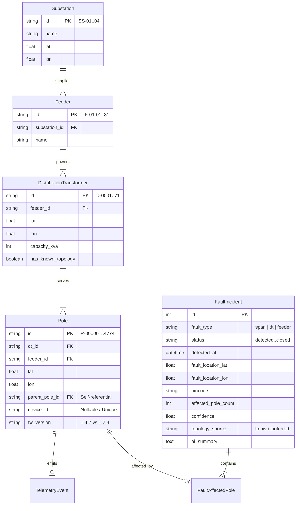
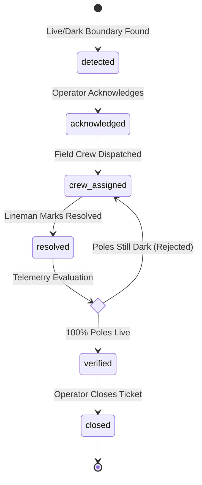

# 📐 System Architecture & Design Specification

This document details the system design, data models, graph algorithms, noise filtering logic, and real-time streaming infrastructure of the KSPDB Power Fault Localization System.

---

## 1. System Overview & Technology Stack

The KSPDB Power Fault Localization System is built as a reactive, multi-tier asynchronous architecture designed to handle real-time IoT telemetry from thousands of electrical poles with zero blocking execution.

- **Frontend**: React 18 + Vite + Leaflet served via Nginx with WebSocket streaming (`/ws`).
- **Backend**: FastAPI (Python 3.12) running Uvicorn with async context execution.
- **Database**: PostgreSQL 16 with `asyncpg` non-blocking driver and SQLAlchemy 2.0 ORM.
- **AI Engine**: Groq API (`llama-3.3-70b-versatile`) with zero-token PostgreSQL DB caching.

---

## 2. Relational Database Schema

---

## 3. Core Algorithms

### A. Graph Topology Construction (`TopologyService`)
Electrical distribution networks under a Distribution Transformer (DT) form a **Radial Directed Acyclic Graph (Tree DAG)** rooted at the DT location $(lat_{\text{DT}}, lon_{\text{DT}})$.

1. **Known Wiring (52% of DTs)**: Constructed directly from `parent_pole_id` foreign keys.
2. **Missing Topology (48% of DTs)**: Inferred using a **Bearing-Constrained Spatial Nearest-Neighbor Heuristic**:
   - Starting at the DT, the nearest unvisited pole is selected as the initial trunk root.
   - Consecutive poles are connected if the angular bearing deviation $\Delta \theta < 120^\circ$ (preventing sharp backtracking).
   - Unvisited clusters within 200m are attached as spur branches perpendicular to the trunk bearing.

### B. Live/Dark Boundary Localization (`FaultDetector`)
- Walks radial DT trees top-down from root poles to leaves.
- Identifies span breaks using the boundary condition:
  $$\text{State}(P_{\text{parent}}) = \text{LIVE} \quad \land \quad \text{State}(P_{\text{child}}) = \text{DARK}$$
- Calculates mid-span fault coordinates and groups all $N$ downstream dark poles into **1 single incident ticket**.

### C. Dead Sensor Suppression (`NoiseFilter`)
- Prevents false alarms when an IoT sensor fails while power is flowing:
  $$\text{If State}(P) = \text{DARK} \quad \land \quad \exists C \in \text{Children}(P) \text{ s.t. State}(C) = \text{LIVE} \implies \text{DEAD SENSOR (Suppressed)}$$

---

## 4. Ticket Lifecycle State Machine

---

## 5. Real-Time Streaming (`ws_manager`)

The system implements a dual-mode communication protocol:
- **WebSocket (`/ws`)**: Pushes real-time JSON events (`ticket_created`, `ticket_verified`) to connected web clients in <100ms.
- **HTTP Polling**: 4-second safety fallback for resilience against temporary connection drops.
