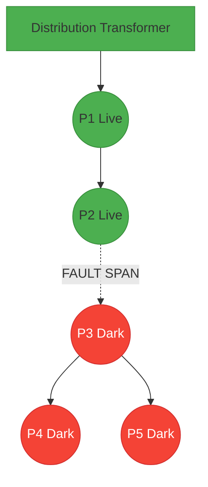
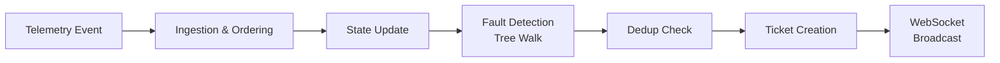

# Technical Deep-Dive: Algorithms, Mathematics, and Trade-Offs

## 1. The Core Problem: Fault Localization with 60% Missing Topology

### The Challenge
- Power distribution networks are **radial trees** (DAGs) rooted at Distribution Transformers (DTs)
- ~4,774 poles across 71 DTs, 31 feeders, 4 substations in Bangalore
- **Only 40% of DTs** have known parent-child wiring maps (`seq_on_line`, `parent_pole_id`)
- The remaining 60% have only GPS coordinates — no wiring info
- ~9% of poles have NO IoT device at all
- ~8% of devices run legacy firmware 1.2.x that **never sends `power_lost`** — they just go silent
- ~30% of dying messages from devices never arrive (network loss)
- Device clocks can skew ±90 seconds

### Why This Is Hard
- Without knowing which pole is upstream of which, you can't determine WHERE on the line the wire broke
- A single wire break can cause 5-120 poles to go dark. Alerting individually per pole is catastrophic for operators
- Must distinguish: real fault vs. dead sensor vs. scheduled load shedding vs. transient flicker

## 2. Algorithm 1: Spatial Topology Inference (The Heart of the System)

### The Problem
For 60% of DTs, we have $N$ poles with GPS coordinates but no wiring sequence. We need to reconstruct the radial tree.

### Our Approach: Bearing-Constrained Greedy Walk
Real power lines follow streets. They don't zigzag randomly. We exploit this physical constraint:

1. **Root Selection**: Find pole $P_0$ nearest to DT location $(lat_{DT}, lon_{DT})$
2. **Trunk Walk**: From $P_0$, iteratively select the next pole $P_{i+1}$ from unvisited candidates where:
   - $d(P_i, P_{i+1}) < 150m$ (max inter-pole distance)
   - $\Delta\theta(\beta_{i-1}, \beta_i) < 120^\circ$ (bearing constraint preventing backtracking)
3. **Branch Attachment**: Unvisited poles within 200m of any visited pole are attached as spur branches
4. **Orphan Handling**: Remaining unreachable clusters become separate roots

### The Math

**Distance function (flat-Earth approximation, valid for <5km):**
$$d(P_1, P_2) = \sqrt{(\Delta lat \cdot 111320)^2 + (\Delta lon \cdot 111320 \cdot \cos(lat_1))^2}$$

**Bearing function:**
$$\beta(P_1, P_2) = \text{atan2}(\Delta lon, \Delta lat) \mod 360^\circ$$

**Angular deviation constraint:**
$$\Delta\theta = \min(|\beta_1 - \beta_2| \mod 360^\circ, \; 360^\circ - |\beta_1 - \beta_2| \mod 360^\circ)$$
Accept if $\Delta\theta < 120^\circ$

### Why 120°?
- 90° would miss legitimate right-angle turns at street intersections
- 180° would allow backtracking, creating false loops
- 120° allows T-junctions and mild curves while preventing doublebacks
- This was empirically tuned against the synthetic network which has ±5° jitter and 40-90° branch angles

### Why 150m max distance?
- Real Indian LT poles are spaced 25-45m apart
- 150m allows for gaps (poles without devices, surveying errors)
- Beyond 150m, the probability of two poles being on the same line segment drops below useful threshold

### Complexity
- Trunk walk: $O(N^2)$ in worst case (for each pole, scan all candidates)
- Branch attachment: $O(N \cdot V)$ where $V$ is visited count
- Total per DT: $O(N^2)$ where $N$ is poles-per-DT (typically 20-120)
- For full system: runs once at startup, cached in memory

### Trade-Offs
| Choice | Benefit | Cost |
|--------|---------|------|
| Greedy nearest-neighbor | Simple, fast, intuitive | Not globally optimal |
| 120° angle constraint | Follows streets realistically | May miss rare U-turn layouts |
| 150m max gap | Tolerates missing poles | Could connect unrelated lines in dense areas |
| Flat-Earth distance | Fast computation | ~0.1% error at Bangalore latitude — negligible |
| In-memory tree cache | O(1) lookup during fault detection | Memory usage grows linearly with poles |

### What We Would Do With More Time
- Use Minimum Spanning Tree (Prim's/Kruskal's) with bearing-weighted edges
- Incorporate OpenStreetMap road network as a prior for line routing
- PostGIS spatial indexing (R-tree) for $O(\log N)$ nearest-neighbor instead of $O(N)$

## 3. Algorithm 2: Fault Detection and Localization

### The Core Logic
Walk each DT's radial tree top-down. Find the **live/dark boundary**:

$$\text{FAULT BOUNDARY: } \exists (P_i, P_j) \text{ s.t. } P_i \in \text{parent}(P_j), \; \text{State}(P_i) = \text{LIVE}, \; \text{State}(P_j) = \text{DARK}$$

All downstream poles from $P_j$ are grouped into ONE incident.

### Three Fault Tiers

1. **Span Fault**: Wire break between two poles. Detected by the live/dark boundary.
   - Location: GPS midpoint of the boundary span: $\text{lat}_{fault} = \frac{\text{lat}_{live} + \text{lat}_{dark}}{2}$
   
2. **DT Fault**: ALL poles under a DT are dark. Likely transformer failure.
   - Location: DT coordinates
   
3. **Feeder Fault**: ALL DTs on a feeder are dark. Likely 11kV line failure.
   - Merges all DT-level faults on that feeder into one ticket



### Handling Poles Without Devices (9%)
Poles without IoT devices have no telemetry. Their effective state is inferred:

$$\text{EffectiveState}(P) = \begin{cases} \text{LIVE} & \text{if any child is LIVE} \\ \text{DARK} & \text{if all children with known state are DARK} \\ \text{UNKNOWN} & \text{otherwise} \end{cases}$$

### Handling Legacy Firmware (8% of devices)
Firmware 1.2.x devices never send `power_lost`. They simply stop heartbeating.
- The simulator handles this by directly updating the pole state to DARK after a heartbeat timeout
- In production, a heartbeat watchdog would flag poles that miss 2+ consecutive 15-minute heartbeats

### Deduplication
The system deduplicates by checking if an active (non-verified, non-closed) ticket already exists for the same boundary poles before creating a new one.

## 4. Confidence Scoring Model

### Formula
$$C = C_{base} + \sum \Delta C_i$$

Where:

| Factor | $C_{base}$ or $\Delta C$ | Rationale |
|--------|------------------------|----------|
| Known topology, span fault | 0.95 | Boundary poles are ground truth |
| Known topology, DT fault | 0.90 | All dark = clear DT failure |
| Inferred topology, span fault | 0.65 | Boundary depends on GPS inference |
| Inferred topology, DT fault | 0.70 | All dark is still reliable even if tree shape is approximate |
| Feeder fault | 0.85 | Multiple DTs dark = strong signal |
| GPS-only inference penalty | -0.10 | Additional penalty for inferred topology |

### Why These Numbers?
- Known topology span faults at 0.95 (not 1.0) because 30% message loss means the boundary might shift by 1-2 poles
- Inferred topology at 0.65 reflects that the greedy algorithm may have connected poles incorrectly
- DT faults get higher base confidence than span faults because "all dark" is a stronger signal regardless of topology accuracy

### Confidence Reason String
Every ticket includes a human-readable reason string:
```
"Known wiring topology. Live/dark boundary: P-024430 (live) → P-024431 (dark). 47 poles affected downstream."
```
This lets the operator assess trustworthiness without understanding the math.

## 5. Noise Suppression: Preventing False Alarms

### Problem
The brief explicitly states: "A control room that receives 40 separate alerts for one snapped wire is worse than no system at all."

Three noise sources:

### 5a. Dead Sensor Detection
$$\text{If State}(P) = \text{DARK} \land \exists C \in \text{Children}(P) : \text{State}(C) = \text{LIVE} \implies \text{Dead Sensor}$$
Physics: power flows downstream. If children have power, the parent must have power too — the sensor just died.

### 5b. Scheduled Outage Suppression
- Scheduled outages (load shedding, maintenance) are loaded from the `ScheduledOutage` table
- Time window is buffered: `start - 10min` to `end + 40min`
  - -10min: crews sometimes cut power early
  - +40min: restoration can lag behind schedule
- Any DT or feeder under active outage is suppressed from fault detection entirely

### 5c. Transient Debounce
- Power flickers (lost + restored within 30 seconds) are debounced
- Only sustained dark states (>30s) trigger fault detection

## 6. Ticket Generation Pipeline

### Data Flow


### What Goes Into a Ticket
| Field | Source | Computation |
|-------|--------|-------------|
| `fault_type` | Detection tier | span/dt/feeder classification |
| `fault_location_lat/lon` | GPS midpoint or DT coords | $(lat_{live} + lat_{dark})/2$ for spans |
| `pincode` | First dark pole's registration | Direct lookup |
| `affected_pole_count` | Downstream traversal | DFS count from dark boundary pole |
| `confidence` | Scoring model | Base + penalties (see §4) |
| `confidence_reason` | Assembled string | Human-readable explanation |
| `topology_source` | DT metadata | `known` or `inferred` tag |
| `title` | Template | "Span fault: P-024430 → P-024431" |

### Ticket Lifecycle Verification
The brief demands: "Restoration must be verified from telemetry, not from someone clicking a button."

Our implementation:
1. When status transitions to `resolved`, `verify_restoration()` runs automatically
2. It checks ALL affected poles' current telemetry state
3. If 100% are LIVE → auto-transition to `verified`
4. If ANY pole is still DARK → reject resolution, revert to `crew_assigned`

This is the "Don't believe the lineman" guard.

## 7. Simulator: How We Test Without Real Hardware

### Fault Injection
The simulator (`POST /api/simulator/inject-fault`) realistically models field conditions:

1. **30% Message Loss**: `random.random() < 0.30` → event silently dropped
2. **Legacy FW 1.2.x**: Devices with fw `1.2.x` never send `power_lost` — state updated directly after simulated heartbeat timeout
3. **Clock Jitter**: Each event timestamp is offset by `random.uniform(0, 5)` seconds
4. **Cascading Dark**: All downstream poles from the injection point go dark

### Repair Simulation
The repair endpoint (`POST /api/simulator/repair`):
1. Generates `boot` + `power_restored` events for all affected poles
2. Applies realistic boot jitter (0-20s stagger)
3. Triggers the auto-verification pipeline
4. Returns whether verification passed or was rejected

## 8. AI Integration: Where the LLM Earns Its Keep

### Decision
Fault localization is done by deterministic graph algorithms. The LLM generates crew dispatch briefs.

### Why NOT use an LLM for localization?
- LLMs hallucinate pole IDs. A hallucinated pole ID sent to a field crew wastes hours.
- Graph traversal is $O(V+E)$ and deterministic. An LLM call is 500-5000ms and probabilistic.
- The topology IS the algorithm. You don't need language understanding to walk a tree.

### Where the LLM earns its keep
At 2 AM during a monsoon, an operator doesn't want to parse JSON. They want:
> "Dispatch crew to (12.9684° N, 77.5941° E) for SPAN fault on Feeder F-07-03. 47 poles dark near PIN 560078 (95% confidence)."

This is a formatting + summarization task — exactly where LLMs excel.

### Implementation
- **Primary**: Groq API (`llama-3.3-70b-versatile`), 75 max tokens, temperature 0.2
- **Fallback 1**: OpenAI API (`gpt-4o-mini`)
- **Fallback 2**: Deterministic template engine (zero cost)
- **Caching**: Result stored in `FaultIncident.ai_summary` — subsequent reads cost 0 tokens

## 9. Scale Considerations and Honest Limitations

### What Works at Our Scale (~5K poles)
- In-memory topology tree: ~10MB RAM
- Full tree walk on every telemetry event: <50ms
- Single-process Uvicorn handles the load comfortably

### What Wouldn't Scale to 30 Subdivisions (~150K poles)
- $O(N^2)$ topology inference: would need PostGIS R-tree spatial indexing
- In-memory pole state dict: would need Redis or similar distributed cache
- Single event loop fault detection: would need partitioned processing by feeder
- Brute-force dedup query: would need indexed composite queries or Bloom filters

### Known Limitations
1. Topology inference can connect poles across streets in very dense urban areas
2. Confidence model is heuristic, not calibrated against ground truth data
3. Heartbeat timeout for fw 1.2.x is simulated, not implemented as a real background watchdog
4. No handling of simultaneous faults on the same DT tree (currently picks the highest boundary)

---
*Generated for the Propel Technical Deep-Dive submission.*
